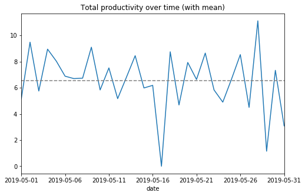
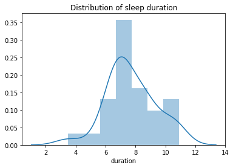

# Life tracking project

## Summary

I tracked my life for one month and recorded my daily activities. Then, I used tools from Data Science to look for interesting patterns that I could use to adjust my lifestyle.

Some interesting graphs:

One surprising observation was the inconsistency of my sleep. I suspect that this has to do with eating too late. **As a real-life consequence of this data analysis, I moved my usual dinner time one hour earlier (7pm instead of 8pm).**

## Notebooks

* [Main](https://nbviewer.jupyter.org/github/maxims94/life-tracking-project/blob/master/notebooks/main.ipynb)
* [Data preprocessing](https://nbviewer.jupyter.org/github/maxims94/life-tracking-project/blob/master/notebooks/preprocessing.ipynb)
* [Data preparation](https://nbviewer.jupyter.org/github/maxims94/life-tracking-project/blob/master/notebooks/preparation.ipynb)
* [Data exploration](https://nbviewer.jupyter.org/github/maxims94/life-tracking-project/blob/master/notebooks/exploration.ipynb)

## Data

* [life_data.csv](https://github.com/maxims94/life-tracking-project/blob/master/data/life_data.csv)
* [life_interval_data.csv](https://github.com/maxims94/life-tracking-project/blob/master/data/life_interval_data.csv)
* [life_total_data.csv](https://github.com/maxims94/life-tracking-project/blob/master/data/life_total_data.csv)
